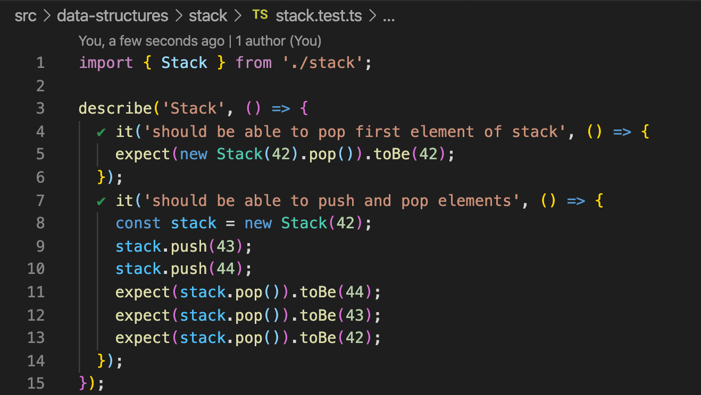

# javascript-excercises

These are exercises I solved to learn javascript and/or programming concepts with an active approach.

`src/data-structures` is the most interesting folder containing implementations of the most common data structures in node.
`src/cracking-code-interview` contains solutions to some excercses presented by "Cracking the Code Interview 6th edition" book.
`src/interview-excercises` are some excercises I have done on interviews.

I use jest as a testing framework. If you are using vscode, I strongly recommend jest-vscode integration https://github.com/jest-community/vscode-jest/ to see test results inline.

This project supports both javascript and typescript. It also has babel, prettier, and eslint configured.

Feel free to use any of this! The boilerplate is ideal for small projects like this.
